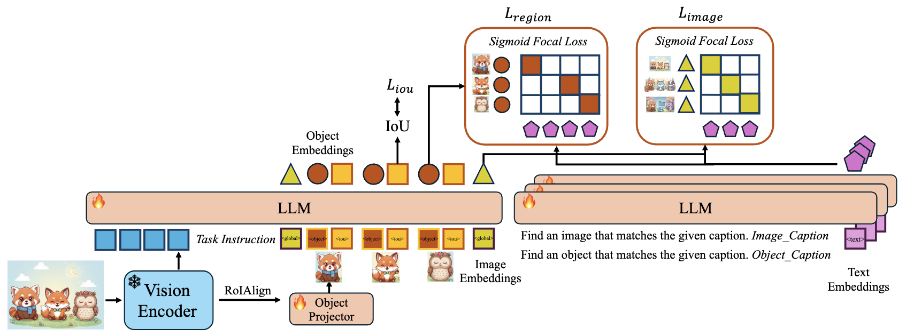
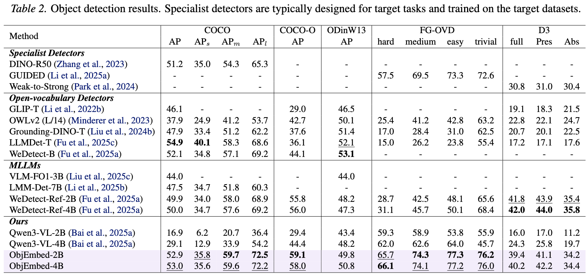
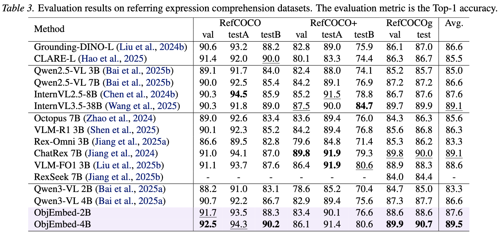
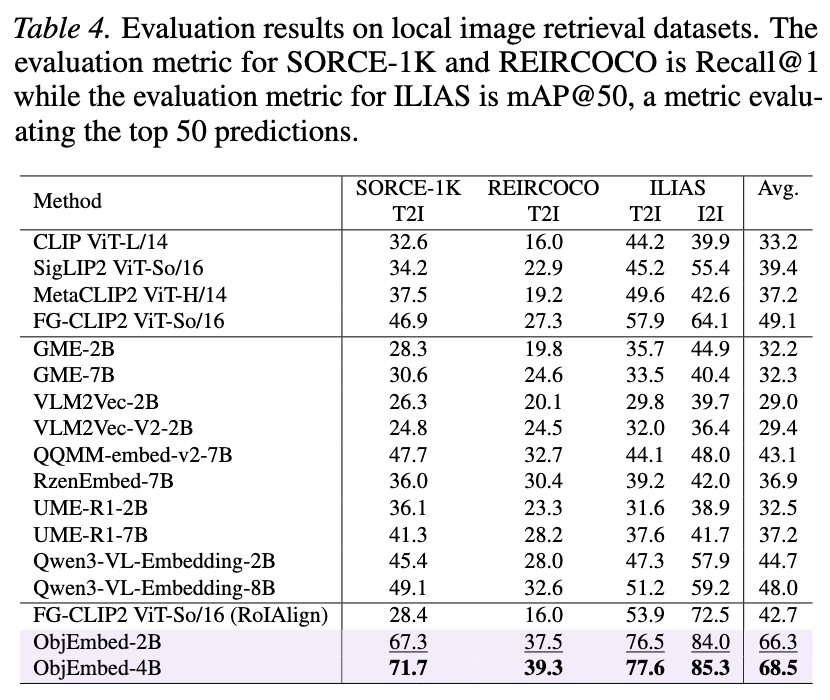
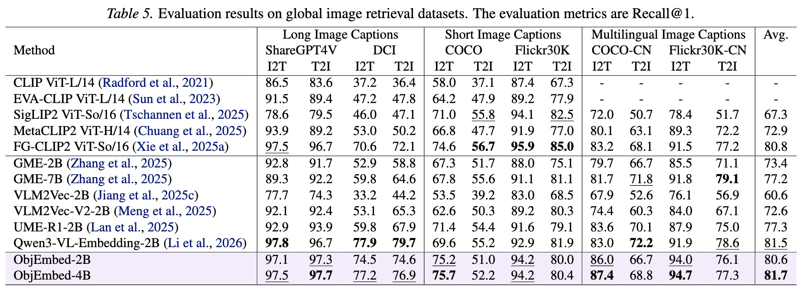

# ObjEmbed: Towards Universal Multimodal Object Embeddings

This is the official PyTorch implementation of ObjEmbed. Our paper can be found at [here](https://arxiv.org/abs/2602.01753).

If you find our work helpful, please kindly give us a star 🌟

Here is the [中文版指南](./README_zh.md).

## 👀 ObjEmbed Overview

<p align="left">
    
</p>

Aligning objects with corresponding textual descriptions is a fundamental challenge and a realistic requirement in vision-language understanding. While recent multimodal embedding models excel at global image-text alignment, they often struggle with fine-grained alignment between image regions and specific phrases. 

In this work, we present ObjEmbed, a novel MLLM embedding model that decomposes the input image into multiple regional embeddings, each corresponding to an individual object, along with global embeddings. It supports a wide range of visual understanding tasks like visual grounding, local image retrieval, and global image retrieval. 

ObjEmbed enjoys three key properties: 
- **Object-Oriented Representation**: It captures both semantic and spatial aspects of objects by generating two complementary embeddings for each region: an object embedding for semantic matching and an IoU embedding that predicts localization quality. The final object matching score combines semantic similarity with the predicted IoU, enabling more accurate retrieval.
- **Versatility**: It seamlessly handles both region-level and image-level tasks.
- **Efficient Encoding**: All objects in an image, along with the full image, are encoded in a single forward pass for high efficiency. 

Superior performance on 18 diverse benchmarks demonstrates its strong semantic discrimination.

## 🔥 Update
- [2026.2.3] Release the code and paper.

## 📈 Experimental Results

#### 📍 Model Zoo

- [ObjEmbed-2B](https://huggingface.co/fushh7/ObjEmbed-2B)
- [ObjEmbed-4B](https://huggingface.co/fushh7/ObjEmbed-4B)

We use [WeDetect-Base-Uni](https://github.com/WeChatCV/WeDetect) as the proposal network. You can download the checkpoint at huggingface:
- [WeDetect-Base-Uni](https://huggingface.co/fushh7/WeDetect)

#### 📍 Results

<p align="left">
    
</p>
<p align="left">
    
</p>
<p align="left">
    
</p>
<p align="left">
    
</p>

## 🔧 Install

#### Our environment

```
pytorch==2.6.1+cu124
transformers==4.57.1
trl==0.17.0
accelerate==1.10.0
```

- Install the environment as follows.

```
pip install transformers==4.57.1 trl==0.17.0 accelerate==1.10.0 -i https://mirrors.cloud.tencent.com/pypi/simple
pip install pycocotools terminaltables jsonlines tabulate ddd-dataset torchmetrics lvis -i https://mirrors.cloud.tencent.com/pypi/simple
```
- Evaluating on LVIS should make sure `numpy<=1.24`.


## ⭐ Demo

#### 📍 Referring Expression Comprehension 
```
# output the top1 prediction
python infer_objembed.py --objembed_checkpoint /PATH/TO/OBJEMBED --wedetect_uni_checkpoint /PATH/TO/WEDETECT_UNI --image assets/demo.jpg --query "The car's license plate in HAWAII" --task rec --visualize
```
<p align="left">
    
</p>


#### 📍 Image Retrieval

```
python infer_objembed.py --objembed_checkpoint /PATH/TO/OBJEMBED --wedetect_uni_checkpoint /PATH/TO/WEDETECT_UNI --image image1.jpg image2.jpg image3.jpg --query "YOUR_QUERY" --task retrieval_by_image
```


## 📏 Evaluation
#### 📍 Evaluation Dataset Preparation

You can download the datasets from the following links:
- COCO: https://cocodataset.org/#home
- LVIS: https://www.lvisdataset.org/
- COCO-O: https://github.com/alibaba/easyrobust/tree/main/benchmarks/coco_o
- odinw13: https://huggingface.co/GLIPModel/GLIP/tree/main/odinw_35
- fg-ovd: https://github.com/lorebianchi98/FG-OVD/tree/main/benchmarks
- d3: https://github.com/shikras/d-cube?tab=readme-ov-file#download
- refcoco/+/g: https://huggingface.co/datasets/fushh7/eval_refcoco
- sorce_1k: https://huggingface.co/datasets/lcxrocks/sorce-1k
- reircoco: https://huggingface.co/datasets/haoxiangzhao/REIRCOCO
- ilias: https://huggingface.co/datasets/vrg-prague/ilias
- sharegpt-4v: https://github.com/ShareGPT4Omni/ShareGPT4V/blob/master/docs/Data.md
- dci: https://github.com/facebookresearch/DCI
- coco_caption_2017: https://cocodataset.org/#home
- flickr30k: https://huggingface.co/datasets/nlphuji/flickr30k
- coco_cn: We have provided.
- flickr30k_cn: https://github.com/li-xirong/cross-lingual-cap

#### 📍 Visual Grounding
```
cd eval_grounding
export PYTHONPATH=../

# coco / coco_o / lvis / FG-OVD / d3 / odinw13
torchrun --nproc-per-node=8 --nnodes=1 --node_rank=0 --master_addr="127.0.0.1" --master_port=29500 eval.py --checkpoint /PATH/TO/OBJEMBED --dataset coco --nms --task_specific_visual_prompt

# refcoco
torchrun --nproc-per-node=8 --nnodes=1 --node_rank=0 --master_addr="127.0.0.1" --master_port=29500 eval.py --checkpoint /PATH/TO/OBJEMBED --dataset refcoco --num_select 20 --task_specific_visual_prompt
```
- Please change the dataset path in Line `47-417` of `eval_grounding/eval.py`.
- For each dataset, users should first extract proposals for each image and save them as json files. You can use `generate_proposal.py` as an example code. We provide refcoco proposals at [here](https://huggingface.co/datasets/fushh7/eval_refcoco).

#### 📍 Image Retrieval
```
cd eval_retrieval
export PYTHONPATH=../

# sharegpt4v / dci / coco / coco_cn / d3 / flickr30k / flickr30k_cn
# sorce_1k / reircoco / ilias / ilias_i2i
torchrun --nproc-per-node=8 --nnodes=1 --node_rank=0 --master_addr="127.0.0.1" --master_port=29500 eval.py --checkpoint /PATH/TO/OBJEMBED --dataset sorce_1k
```
- Please change the dataset path in Line `19-90` of `eval_retrieval/eval.py`.
- For each dataset, users should first extract proposals for each image and save them as json files. You can use `generate_proposal.py` as an example code. We provide refcoco proposals at [here](https://huggingface.co/datasets/fushh7/eval_refcoco).


## 🙏 Acknowledgement

- ObjEmbed is based on many outstanding open-sourced projects, including [WeDetect](https://github.com/WeChatCV/WeDetect), [transformers](https://github.com/huggingface/transformers), [Qwen3-VL](https://github.com/QwenLM/Qwen3-VL) and many others. Thank the authors of above projects for open-sourcing their assets!

## ✒️ Citation

If you find our work helpful for your research, please consider citing our work.   

```bibtex
@article{fu2026objembed,
  title={ObjEmbed: Towards Universal Multimodal Object Embeddings},
  author={Fu, Shenghao and Su, Yukun and Rao, Fengyun and LYU, Jing and Xie, Xiaohua and Zheng, Wei-Shi},
  journal={arXiv preprint arXiv:2602.01753},
  year={2026}
}
```

## 📜 License

- Our models and code are under the Apache 2.0 License.

